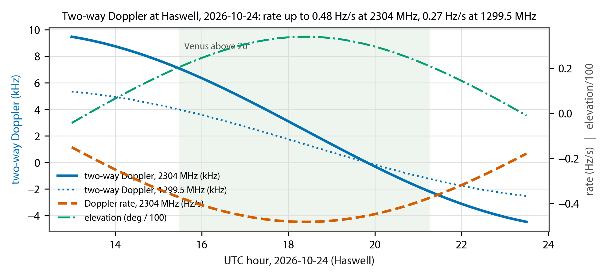
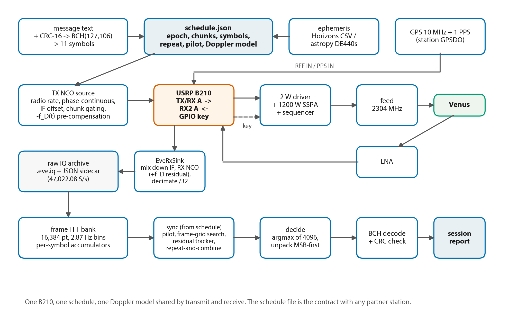
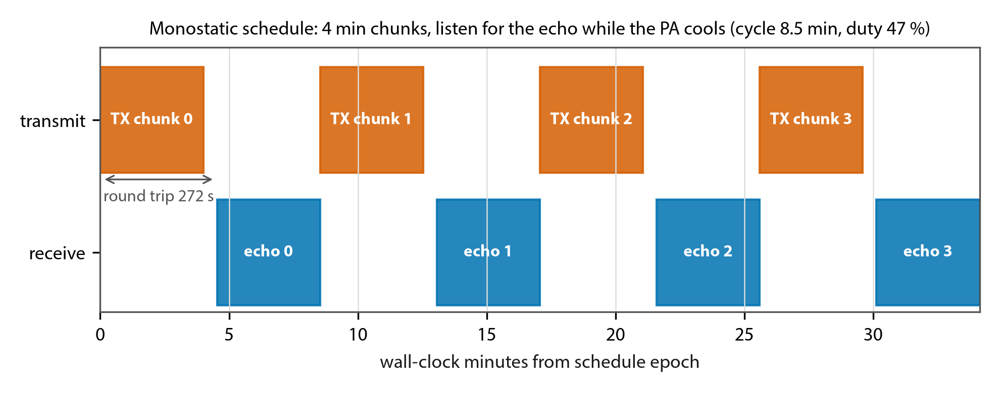
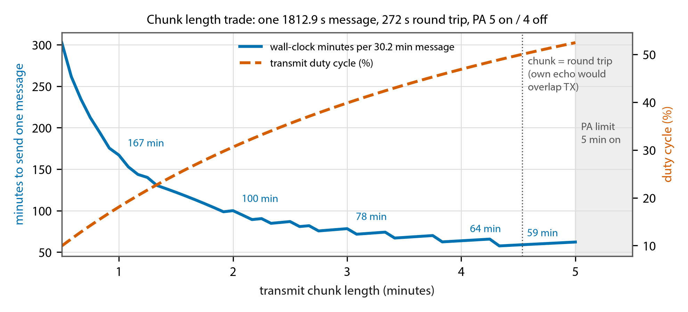

# Earth-Venus-Earth Modem — Design Description and Interface Control Document

| | |
|---|---|
| Document | DSES EVE Modem Design and ICD |
| Revision | Rev A — DRAFT for team review |
| Date | 2026-09-10 |
| Prepared by | Rick Hambly, K0GD, Deep Space Exploration Society |
| Waveform design | Pete Wyckoff, KA3WCA, Open Research Institute ("Venus Bounce Transmitter Spiral #2") |
| Status | Design baseline; parameters marked TBC await confirmation from ORI. Draft 2 adds the band plan of 2026-09-10 (23 cm at 1299.5 MHz for Venus 2026; 13 cm later; EME on both bands without amplifiers) |

This document describes the DSES implementation of the ORI Earth-Venus-Earth (EVE)
waveform for the Venus inferior conjunction of 24 October 2026, and it defines every
interface the implementation touches: the signal on the air, the station hardware, the
timing and frequency references, the files exchanged with other stations, and the boundary
with the DSES Radio Astronomy Workbench. Sections 1 through 5 are the design description.
Sections 6 through 9 are the interface control document (ICD). Section 10 is the decision
and open-issue register. Anything in this document that another team member depends on is
in the ICD sections, so that a change there is a change everyone sees.

The ORI reference material is the EVE repository on GitHub (OpenResearchInstitute/EVE):
the MATLAB simulation in `signal_design/` (May–June 2026), the Python transmit generator
in `signal_design/Python_Implementation/` (August 2026, the current implementation per
ORI), the ORI link budget notebook, and the CAMRAS validation white paper. All ORI code is
GPL-3.0 and is credited to Pete Wyckoff and ORI wherever it is used.

# 1. Purpose and summary

The DSES 60-foot dish at Haswell will attempt to bounce a digital message off Venus near
inferior conjunction and decode the echo. ORI designed the waveform and validated it in
simulation, and ORI has a transmit-side generator that writes the waveform to a SigMF file
for playback through a USRP B210 in GNU Radio. ORI has no receiver. DSES needs a complete,
runnable modem: a transmitter that fits the DSES station's duty cycle and keying, a receiver
that decodes echoes, and the synchronization, Doppler, and scheduling machinery that the
reference design assumes away.

The design decisions in this revision:

- **The modem streams.** The transmitter synthesizes the waveform on the fly, driven by a
  schedule, rather than playing a pre-generated file. SigMF export and import are retained
  for interoperability with ORI's files, for bench tests, and for sharing with other
  stations, but they are not how the station transmits (section 3).
- **The 2026 Venus attempt is a 23 cm operation at 1299.5 MHz.** The 13 cm package will
  not be ready this year, so DSES transmits with the 23 cm package retuned from 1296 to
  1299.5 MHz, the frequency Dwingeloo, Stockert, and Effelsberg use. The modem is
  frequency-agile (1296, 1299.5, 2304, 2400 MHz, and others); every frequency-dependent
  quantity is computed per schedule (section 2.4).
- **Monostatic operation is the baseline**, with reception by a European station as the
  upside case at 1299.5 MHz. At 23 cm the monostatic link is 2 to 4 dB below the design
  point; repeat-and-combine over a session recovers that, and a 25 m or 100 m receiver
  adds 3 or 15 dB (section 2.2).
- **EME testing needs no power amplifier.** The B210's own output into the dish gives a
  C/N0 of +12 dB-Hz at 1296 MHz and +16 dB-Hz at 2304 MHz off the Moon, so both bands can
  be tested at and below the design point before either amplifier exists (section 4.6).
- **The 30-minute message is sent in chunks** of up to the Earth-Venus round-trip time
  (272 s on 24 October), with the station listening for the echo of each chunk while the
  amplifier cools. The chunk length is a parameter; 4 minutes is the working value, giving
  one message in about 64 minutes at 47 percent transmit duty (section 4).
- **The ORI Python generator's conventions are the air-interface specification** (section
  6). They differ from the earlier MATLAB simulation in bin width, frame count, bit order,
  and comb placement; ORI confirmed on 9 September that the MATLAB was early simulation and
  the Python is the current implementation. Two numerical inconsistencies in the Python
  are resolved here by definition and flagged TBC.
- **The modem is a separate project from the Workbench.** It reuses the Workbench's proven
  B210 code by factoring that code into an importable module (section 5 and section 9).
- **Doppler is handled on both ends**: ephemeris pre-compensation on transmit so the echo
  arrives at the nominal frequency, and residual tracking on receive. On conjunction day
  the two-way Doppler rate at Haswell reaches 0.48 Hz/s, which is 14 tone spacings across
  one symbol if left uncorrected (section 4.4).
- **Timing comes from GPS**, not a maser. A non-coherent receiver only needs to know which
  0.35-second frame belongs to which symbol; GPS time on the B210 and a shared UTC epoch
  provide that to a millisecond (section 4.3).
- **Validation runs simulation first, then B210 loopback, then a low-power Earth-Moon-Earth
  test, then Venus** (section 5.4).

# 2. Mission context

## 2.1 Geometry on conjunction day

Computed for Haswell (38.3808° N, 103.1561° W, 1311 m) with astropy's built-in ephemeris;
the flight software will use a JPL Horizons table for the operational numbers.

| Quantity | 2026-10-24 | Notes |
|---|---|---|
| Earth-Venus distance | 0.273 AU (40.8 million km) | Minimum of the apparition |
| Round-trip light time | 272 s (4.5 min) | Sets the maximum monostatic chunk length |
| Venus above 20° at Haswell | 15:30 – 21:15 UTC (5.75 h) | Rises 13:25, sets 23:30 UTC |
| Maximum elevation | 34° at 18:30 UTC | |
| Angular separation from the Sun | about 6° | Solar noise in the sidelobes raises Tsys; quantify in the link budget |
| Two-way Doppler shift | 1299.5 MHz: +5.3 → −2.5 kHz; 2304 MHz: +9.5 → −4.5 kHz; zero at 19:50 UTC | Scales with frequency |
| Two-way Doppler rate | 1299.5 MHz: up to −0.27 Hz/s; 2304 MHz: up to −0.48 Hz/s (18:30 UTC) | 45 Hz (8 tone spacings) or 79 Hz (14) across one 165 s symbol |

Venus stays within 10 percent of minimum distance from 7 October to 12 November, so the
attempt is a multi-week window, not one day. The round-trip time and Doppler numbers above
change slowly over that window and the schedule generator recomputes them per session.



## 2.2 Link budget

The ORI link budget notebook's DSES case (18.29 m dish, 69 percent efficiency, 1500 W,
2304 MHz, 0.4 dB LNA, 30° elevation, minimum distance) gives a monostatic C/N0 of
+1.7 dB-Hz. Pete Wyckoff sized the waveform for C/N0 = 0 dB-Hz. The 2026 attempt is at
1299.5 MHz with the 23 cm package, so the table scales the ORI case to the bands DSES can
actually use, holding the dish and the radar cross-section fixed (the two-way path scales as
the wavelength squared, the two antenna gains as its inverse fourth power, net −5 dB at 23 cm):

| Case | C/N0 (dB-Hz) | Basis |
|---|---|---|
| DSES monostatic, 2304 MHz, 1500 W, Tsys 76 K | +1.7 | ORI notebook, DSES dataclass |
| DSES monostatic, 2400 MHz, 1500 W, Tsys 76 K | +2.0 | scaled |
| DSES monostatic, 1299.5 MHz, 1500 W, Tsys 55 K | −1.8 | scaled; albedo 0.152 (CAMRAS) |
| DSES monostatic, 1299.5 MHz, 1000 W, Tsys 55 K | −3.6 | scaled |
| Cross-check: Dwingeloo's measured +0.65 (25 m, 1 kW, 1299.5 MHz) scaled to an 18.3 m dish | −4.8 | gain to the fourth power |
| DSES transmits at 1299.5 MHz, Dwingeloo or Stockert receives (25 m) | monostatic +2.7 | receive gain only |
| DSES transmits, Effelsberg receives (100 m, Tsys 25 K) | monostatic +15 to +18 | ORI proposal: +17.7 dB-Hz at 2304 MHz |
| Repeat-and-combine, N passes of the message | +10 log10 N | five passes = +7 dB |

Three conclusions. First, at 23 cm a single monostatic pass sits 2 to 4 dB below the design
point before solar noise, so a single-pass decode is not the plan; five passes in the
5.75-hour window (+7 dB) bring the session to +3 to +5 dB-Hz equivalent, which closes.
Second, any European station that receives with the DSES schedule file turns the link
positive on its own: Dwingeloo or Stockert by about 3 dB, Effelsberg by 15 dB or more.
Third, every decibel of the transmit chain matters at 23 cm: the actual amplifier power,
the feed match, and the receiver Tsys are the open items that set where in that table DSES
lands (O2). ORI's analytic check of the waveform gives a frame error rate of 2 percent at
0 dB-Hz, 38 percent at −1 dB-Hz, and 60 percent at −1.33 dB-Hz (AWGN); Pete's MATLAB
channel adds Rayleigh fading with a 1.05 dB correction, and the DSES receiver validation
(section 5.4) includes that so the margin is stated honestly.

The 13 cm case, when that package exists, is the ORI +1.7 dB-Hz at 2304 MHz or +2.0 at
2400 MHz, with the same repeat-and-combine arithmetic on top.

## 2.3 Stations and frequencies

| Station | Role in October 2026 | Frequency |
|---|---|---|
| DSES Haswell, 18.3 m | Transmit and receive (this document) | **1299.5 MHz in 2026** with the 23 cm package (1296 MHz native; retune TBC, O2). 13 cm package (2304 or 2400 MHz) not before the next apparition |
| Dwingeloo (CAMRAS), 25 m, 1000 W | Transmit and receive, own campaign | 1299.5 MHz only (confirmed by ORI 2026-09-09) |
| Effelsberg, 100 m | Receive only, opportunistic, secondary to a baseline survey | Follows Dwingeloo; proposal alternates 1299.5 and 2304 MHz |
| Stockert, 25 m | Receive, own campaign | 1299.5 MHz |

Because DSES will be on 1299.5 MHz, the European stations can in principle receive DSES
during the mutual window, roughly 13:30 to 16:30 UTC at low elevation on both ends
(estimate, to be computed exactly when a session is arranged); the schedule file of
section 8.1 is what makes that possible. Monostatic remains the baseline because it is the
only mode DSES controls end to end.

## 2.4 Band plan and frequency dependence

The B210 tunes 70 MHz to 6 GHz, and the modem carries the dial frequency in the schedule,
so the same software serves every band. What changes with frequency is computed per
schedule from the ephemeris; what does not change is the waveform itself, which ORI defines
with the same parameters on every band (their own smoke-test file is at 1296 MHz).

| Band | Use | Two-way Doppler, Venus at conjunction | Peak rate, per symbol | Doppler spread (ORI: 1.5 Hz at 1299.5, scaled) |
|---|---|---|---|---|
| 1296 MHz | EME tests, 23 cm package native | n/a (Moon: about ±2 kHz) | Moon: small | libration, variable |
| 1299.5 MHz | **Venus 2026**; Dwingeloo, Stockert, Effelsberg band | +5.3 to −2.5 kHz | 0.27 Hz/s, 45 Hz (8 spacings) | 1.5 Hz |
| 2304 MHz | 13 cm package, next apparition | +9.5 to −4.5 kHz | 0.48 Hz/s, 79 Hz (14 spacings) | 2.66 Hz |
| 2400 MHz | 13 cm alternative | +9.9 to −4.7 kHz | 0.50 Hz/s, 83 Hz (14 spacings) | 2.77 Hz |

One consequence for the waveform: ORI's 2.87 Hz bin is matched to the spread at 2304 MHz.
At 1299.5 MHz the spread is 1.5 Hz, so a 2.87 Hz bin is wider than the channel needs and
costs about 2.8 dB relative to a bin matched to 1.5 Hz. A matched 23 cm variant would be a
different waveform (tone spacing 3 Hz, symbol 315 s for the same frame count) that the
European receivers would have to match; the recommendation is to keep ORI's parameters on
every band for interoperability and to book the 2.8 dB against repeat-and-combine, unless
ORI decides otherwise (O11). The RF package, feed, and amplifier per band are station items
(section 7).


# 3. Architecture

## 3.1 The question: pre-generate or stream

ORI's implementation generates the complete waveform as a SigMF file and plays it through
a B210 with GNU Radio. For a 30-minute message at 250 kS/s that is a 3.6 GB file, valid for
one message and one Doppler profile. DSES will not operate that way, for four reasons:

1. **The station transmits in chunks with gaps** (section 4). A pre-generated file has no gaps; cutting it at run time is the same work as generating it at run time.
2. **Doppler pre-compensation changes continuously** and depends on the date, time, and target. A file generated for one session is wrong for the next.
3. **The waveform is trivial to synthesize**: one complex exponential at a time. At the radio's 1.5 MS/s that is a few million complex multiplies per second, well inside a Python NumPy budget, with no resampling because the tone is generated directly at the radio rate.
4. **Nothing is lost.** The transmit log records the schedule and the symbols, which together are a complete description of what went out; the IQ can be regenerated exactly.

The decision is therefore **stream**. The SigMF path is kept as an export (write ORI-format
files for other stations and for the bench) and as an import (play an ORI file through the
same transmit chain for cross-checks).

## 3.2 System block diagram



The transmitter and receiver share one B210, one schedule, and one Doppler model. The
schedule is the contract between them and, in bistatic operation, between DSES and the
partner station.

## 3.3 Modes

| Mode | Transmit | Receive | Schedule |
|---|---|---|---|
| Monostatic (baseline) | DSES, chunked | DSES, own echo, between chunks | Chunk length ≤ round trip; receive window = chunk + round trip |
| Bistatic transmit | DSES, continuous 30-min message, repeated | Partner station | Continuous, repeat count N; partner receives the schedule file |
| Bistatic receive | Partner | DSES | DSES receives the partner's schedule file |
| EME test | DSES, chunks of ≤ 2.5 s (Moon round trip) | DSES | Same machinery, `target=moon`, shorter symbol |
| Bench | B210 internal leakage, no PA | B210 | Loopback, noise added offline |

# 4. Operating concept

## 4.1 The message and its timing

One message is one BCH codeword: 106 payload bits (90 message bits plus a 16-bit CRC),
encoded to 127 bits, carried in 11 symbols of 12 bits each (132 bit positions, the last 5
zero). Each symbol is one tone held for 473 frames of 1/2.87 s. The numbers:

| Quantity | Value | Derivation |
|---|---|---|
| Frame (FFT block) | 0.34843 s | 1 / 2.87 Hz |
| Symbol | 164.808 s | 473 frames |
| Message (11 symbols) | 1812.9 s = 30.2 min | 11 × 164.808 s |
| Payload rate | 0.058 bit/s | 106 / 1812.9 |
| Message text | 11 ASCII characters (90 bits, 8-bit packed) | |

The frame is the unit everything is scheduled in. Frames are numbered from the schedule
epoch; frame k carries symbol floor(k / 473) mod 11 of message repetition floor(k / 5203).
A transmitter sends whichever frames its schedule says are on; a receiver files every frame
it receives into the accumulator of the symbol that frame belongs to. Because detection is
non-coherent, frames of one symbol need not be contiguous in time, which is what makes
chunking possible.

## 4.2 Monostatic chunking

DSES listens to its own echo, so the transmitter must be silent when the echo arrives.
With round-trip time RTT, a chunk of length T_on transmitted from t = 0 returns during
[RTT, RTT + T_on]. The next chunk may start at RTT + T_on. The DSES amplifiers add a duty
limit of about 5 minutes on and 4 minutes off. The constraints are therefore
T_on ≤ min(RTT, 300 s) and T_off ≥ max(RTT, 240 s), and the cycle is T_on + T_off.



Shorter chunks are kinder to the transmitter but cost wall-clock time, because every chunk
pays the full round trip in silence:

| Chunk T_on | Cycle | Duty | Chunks per message | Wall-clock per message |
|---|---|---|---|---|
| 1 min | 5.5 min | 18 % | 31 | 167 min |
| 2 min | 6.5 min | 31 % | 16 | 100 min |
| 3 min | 7.5 min | 40 % | 11 | 78 min |
| **4 min** | **8.5 min** | **47 %** | **8** | **64 min** |
| 4.5 min (= RTT) | 9.0 min | 50 % | 7 | 59 min |



The working value is **4 minutes**: it keeps a 30-second guard below the round trip so a
chunk's own echo never overlaps the next transmission, stays a minute under the amplifier's
5-minute limit, and delivers a message in 64 minutes. On conjunction day the 5.75-hour
window above 20° elevation holds five message passes, which is what repeat-and-combine
needs. Chunk boundaries fall on frame boundaries; a symbol may straddle a gap.

Symbol boundaries and chunk boundaries are independent. The alternative of making each
chunk exactly one symbol (a 165 s chunk, 2.7 min) is a valid setting of the same parameter
and is listed for completeness; it buys nothing the receiver needs and costs 20 percent in
wall-clock time relative to 4-minute chunks.

## 4.3 Time and frequency reference

Pete's design assumes stations sharing a hydrogen maser over White Rabbit. The DSES
receiver is non-coherent, so it needs two things only: to know which frame is which, and to
have the tone land within a fraction of a 2.87 Hz bin for the whole symbol.

- **Time.** A GPS-disciplined 10 MHz and 1 PPS go into the B210's REF IN and PPS IN. The
  modem sets the USRP time to UTC on a PPS edge, so every transmitted sample and every
  received sample carries a UTC timestamp good to well under a millisecond. The schedule
  epoch is a UTC instant; frame boundaries are epoch + k × 0.34843 s. The receiver maps
  arrival time to frame number through the ephemeris round-trip time. The tolerance is a
  fraction of a frame (tens of milliseconds); GPS provides microseconds.
- **Frequency.** The same GPSDO disciplines the B210's master clock. A B210 on its internal
  TCXO is ±2 ppm, or ±4.6 kHz at 2304 MHz with drift of tens of hertz per session; that
  alone would defeat a 2.87 Hz receiver. Locked to a GPSDO the reference is 1e-11 or better,
  0.02 Hz at 2304 MHz.
- **Ephemeris.** Round-trip time and Doppler come from a JPL Horizons table (topocentric,
  one row per second, fetched before the session and stored with the schedule), with
  astropy plus a local DE440s file as the offline fallback. The two are cross-checked
  before every session.

## 4.4 Doppler

The two-way Doppler at 2304 MHz on conjunction day sweeps from +9.5 kHz to −4.5 kHz across
the pass and its rate peaks at −0.48 Hz/s (Figure 1). Across one 165-second symbol that is
79 Hz, 14 tone spacings; across one 0.35-second frame it is 0.17 Hz, six percent of a bin.
So the frame is short enough that a tone stays put within a frame, and the symbol is long
enough that the tone must be steered.

The modem does both halves:

- **Transmit pre-compensation.** The transmit NCO is offset by −f_D(t) for the designated
  receiver's geometry, so the echo arrives at the nominal comb. For monostatic operation
  that is the Haswell two-way Doppler at the echo's arrival time, t + RTT. For bistatic
  operation it is the uplink Doppler at Haswell plus the downlink Doppler at the partner
  (the schedule file names the receiver so both ends agree on who compensates what).
- **Receive residual tracking.** The receive NCO applies the same model from the receiver's
  side, and a slow tracker corrects the residual from the model's error and the reference's
  drift using the energy of the detected tone. Frames are then on the design grid.

The Doppler model is a first-class part of the schedule file so that an offline receiver at
another station can apply exactly what the transmitter assumed.

## 4.5 Repeat-and-combine and the pilot

Because the message is repeated within a session, the receiver keeps accumulators per
symbol across repetitions. Deciding on the sum over N repetitions is equivalent to N times
the frames per symbol, worth 10 log10 N dB of sensitivity: two passes buy 3 dB, five buy
7 dB. The ORI README suggests exactly this; here it is designed in from the start and the
schedule file carries the repeat count.

An optional **pilot** reserves a known tone for the first 40 frames (14 s) of each chunk.
It costs 6 percent of throughput and lets the receiver verify the timing and Doppler model
live, at the start of each chunk, rather than discovering after 64 minutes that the epoch
was off by a frame. The pilot is on for the EME test and for the first Venus sessions; it
is a schedule flag, not a waveform change.

## 4.6 The EME proof test

Everything above is exercised against the Moon before Venus, at very low power. What
changes is parameterized, not rewritten:

| Parameter | Venus | Moon |
|---|---|---|
| Round-trip time | 272 s | 2.5 s |
| Chunk length (monostatic) | ≤ 272 s, working 240 s | ≤ 2.5 s (7 frames), alternating TX and RX |
| Two-way Doppler | ±10 kHz, rate ≤ 0.5 Hz/s | ±4 kHz at 1296 MHz, rate small |
| Spread | 2.87 Hz assumed | Libration spread at 1296 MHz can exceed 5.74 Hz; pick a low-libration window or set R_bw from the predicted spread |
| Link | C/N0 −4 to +2 dB-Hz by band and power | B210 output alone (+10 dBm) gives +12 dB-Hz at 1296 or 1299.5 MHz and +16 dB-Hz at 2304 or 2400 MHz (Tsys 60 / 76 K, mean Moon distance); 0 dBm gives +2 and +6 |
| Frequency | 1299.5 MHz (2026) | 1296 or 1299.5 MHz and 2304 or 2400 MHz: both bands, no amplifier needed |

The B210 alone is the transmitter for EME testing. Its +10 dBm output through the feed
lands 12 to 16 dB above the design point, so the test is run at the design point by turning
the B210 output down, or by adding calibrated noise to the archive offline, with no
amplifier in the chain, on either band, as soon as a feed and a transmit/receive switch at
the feed exist (O12). This decouples validation of the modulation and protocol from the
amplifier schedules entirely, which is why it can start before the 23 cm retune and long
before the 13 cm package.

The EME test proves the schedule and keying at the fastest cadence the design will ever
use, the GPS timing, the Doppler module with a different target, the receiver, and
repeat-and-combine, end to end. Its switching rate (2.5 s alternation) is a station
question recorded in section 10.

# 5. Software design

## 5.1 Module layout

The modem is a Python package `eve/` in this project, pure NumPy/SciPy in the core with GNU
Radio only in the two blocks that touch the radio.

| Module | Responsibility |
|---|---|
| `params.py` | `EveParams`: R_bw, N_fft, M, N_frames, N_sym, BCH n/k, IF offset, radio decimation, with the Python-Implementation values as defaults and the MATLAB set selectable for reproducing Pete's curve. Derived quantities (modem rate, frame, symbol, message time). |
| `bch.py` | BCH(127,106), t = 3, narrow-sense systematic, generator polynomial octal 11554743 over GF(2^7) with primitive x^7+x^3+1. Encoder and Berlekamp-Massey / Chien decoder. Verified against `galois` and against the Lin & Costello table. |
| `message.py` | Text ↔ 90 bits (8-bit ASCII, zero-padded); CRC-16-CCITT (0x1021, init 0xFFFF); payload assembly; verification on decode. |
| `modem.py` | Symbol packing (MSB first, 132 positions), tone map, the streaming synthesizer (phase-continuous, chunk-gated, Doppler-offset NCO at any sample rate), and the receiver core: frame FFT bank, per-symbol magnitude accumulators, decisions, unpacking. Faithful to the ORI conventions; no Doppler or sync inside. |
| `channel.py` | Pete's `channel.m` (AWGN + random phase + Rayleigh, −1.05 dB) plus a streaming extension with Doppler ramp, timing offset, and gaps. |
| `montecarlo.py` | Success-rate vs C/N0 and vs frames-per-symbol curves; the Rayleigh version of ORI's link check. |
| `doppler.py` | Two-way topocentric Doppler and round-trip time vs UTC for target `venus` or `moon`, from a Horizons table (primary) or astropy + DE440s (fallback); visibility window. |
| `schedule.py` | The block-slot timeline: epoch, chunks, receive windows, frame-to-symbol map, repeat count, pilot flag; JSON in and out (section 8.1). |
| `sync.py` | Pilot detection, frame-grid search (±N frames), residual frequency tracker, repeat-and-combine. Everything the reference design does not have, kept out of `modem.py`. |
| `sigmf_io.py` | Export in ORI's SigMF form (`ori:design` block) plus a `dses:` block; import of ORI files for playback. |
| `gr_blocks.py` | `EveToneSource` (schedule-driven NCO source at the radio rate) and `EveRxSink` (decimate to the modem rate, archive IQ, feed the live accumulators). |
| `radio.py` | B210 setup: external reference and PPS, `ref_locked` readback, UTC time set on PPS, IF-offset tune with readback verification, rate readback, GPIO keying line. Factored from the Workbench (section 9). |
| `station.py` | Key-down and cooldown interlocks, PA duty enforcement, abort, session log. |
| `tools/` | `eve_bench.py` (loopback soak, underrun and gap counters, offline noise injection), `eve_session.py` (run a schedule), `eve_decode.py` (offline decode of an archive). |

## 5.2 Transmit path

`EveToneSource` produces samples at the radio rate directly: for sample n at time t_n it
outputs A × exp(j × 2π × (f_IF + d(k) × Δf − f_D(t_n)) × t_n + φ), with d(k) the symbol
of frame k, and φ carried across symbol hops so phase is continuous. Outside an on-window
it outputs zeros and the keying line is released. The block never touches a file; the
schedule is its only input. Buffering follows the Workbench's proven practice for the
B210 transmit edge (deep minimum output buffer, real-time mode during a chunk) so a
4-minute chunk runs without underruns; underruns are counted and logged.

The B210 TX/RX A port drives the amplifier chain; RX2 A takes the LNA. The two ports are
always so assigned; the modem refuses to start if the receive port is on TX/RX.

## 5.3 Receive path

`EveRxSink` takes the B210 stream (radio rate = 32 × modem rate, nominal 1.5047 MS/s),
mixes down by the IF offset and comb centre, applies the receive Doppler NCO, decimates by
32 to the modem rate 47,022.08 S/s, and writes the result to the session archive as
complex64 with a JSON sidecar (section 8.2). At 376 kB/s a full 6-hour window is 8 GB;
the archive is always written so any session can be re-decoded offline with a different
schedule, Doppler model, or receiver. In parallel the live receiver runs the 16,384-point
frame FFT bank, files frame magnitudes into the symbol accumulators, and shows the running
symbol decisions and the tone-strip display.

The decoder is deliberately offline-first: the live view is for the operator; the
decision of record is the offline decode of the archive after the session.

## 5.4 Validation plan

| Stage | What | Gate |
|---|---|---|
| 0 | Reference vectors: ORI generator output for a fixed message; BCH round trip against `galois` | Bit-exact symbols and codeword |
| 1 | Modulator: DSES streaming synthesizer vs ORI file for the same message, same rate | Tones and phase match to float tolerance |
| 2 | Receiver in simulation: Pete's channel (Rayleigh) and ORI's AWGN model; frames-per-symbol sweep | Reproduces both curves; Rayleigh margin stated |
| 3 | Streaming realism: Doppler ramp, chunk gaps, wrong epoch; real CAMRAS Venus echoes (March 2025, public) through the FFT bank | Decodes at the design point with a 0.5 Hz/s ramp; pilot recovers a wrong epoch |
| 4 | B210 loopback on the bench: 4-minute chunk soak, underruns, reference lock, rate readback, transmit frequency vs the lab GPS reference on the E4438C / 53230A | Zero underruns, frequency within 0.1 Hz |
| 5 | EME at very low power | End-to-end decode at C/N0 near 0 dB with the station's own keying |
| 6 | Venus, sessions from mid October | |

# 6. ICD part A — the air interface

This section is the interoperability specification. It follows the ORI Python
implementation exactly where that implementation is definite, and it resolves, by
definition, two places where it is not. Items marked TBC are awaiting confirmation from
Pete Wyckoff and Michelle Thompson (asked 2026-09-09).

## 6.1 Waveform parameters

| Parameter | Symbol | Value | Source and notes |
|---|---|---|---|
| Modulation | | 4096-ary orthogonal FSK, non-coherent | Pete Wyckoff, Spiral #2 |
| FFT bin width = frame rate | R_bw | 2.87 Hz | ORI Python; equals the Doppler-spread forecast at 2304 MHz, applied by ORI on every band. TBC: the MATLAB used 2.67 Hz; see O11 for 23 cm |
| Tone spacing | Δf | 5.74 Hz (= 2 R_bw) | One guard bin between tones |
| Alphabet | M | 4096 tones, 12 bits per symbol | |
| Frames per symbol | N_frames | 473 | ORI Python; its README notes Pete's slide shows about 440. TBC |
| Symbol duration | T_sym | 164.808 s (= 473 / 2.87) | Defined as an integer number of frames. ORI Python uses 164.794 s (472.96 frames); the 14 ms difference is resolved here in favour of whole frames |
| Symbols per message | N_sym | 11 | |
| Message duration | T_msg | 1812.9 s | |
| Occupied bandwidth | | 23.5 kHz (4096 × 5.74 Hz) | |
| FEC | | BCH(127,106), t = 3, narrow-sense, systematic (message bits first) | Generator octal 11554743; identical in MATLAB and Python |
| Payload | | 90 message bits + CRC-16-CCITT (0x1021, init 0xFFFF, no reflection) over the 90 bits, MSB first | ORI Python |
| Message text | | 11 ASCII characters, 8 bits each, MSB first, zero-padded to 90 bits | 90 bits = 11.25 characters; the 12th is truncated |
| Bit-to-symbol map | | 127 coded bits zero-padded to 132; symbol m = bits 12m … 12m+11, first bit most significant | ORI Python. The MATLAB used LSB first |
| Amplitude | A | constant, 0.8 of full scale in ORI files | Constant envelope; Class-C amplifier compatible |
| Phase | | continuous through a symbol; at symbol hops DSES keeps phase continuous (ORI files restart from a global index). Receiver-invisible | |

## 6.2 Tone map and spectral placement

Tone d (0 … 4095) is at baseband frequency f_d = d × Δf above the comb origin, one-sided,
0 to 23,505 Hz. The comb origin sits at an IF offset above the dial frequency so that tone 0
is not on the zero-IF spike:

f_RF(d) = f_dial + f_IF + d × 5.74 Hz, with **f_IF = 25,000 Hz**.

Published operating parameters are therefore two numbers: f_dial (the frequency the
transmitter is tuned to) and f_IF (25 kHz unless a schedule says otherwise). The comb
occupies f_dial + 25.0 kHz to f_dial + 48.5 kHz. A receiver tunes to f_dial, mixes down by
f_IF plus the applicable Doppler, and sees tone d at d × 5.74 Hz. This is the ORI
convention (their README: "tune the B210 25 kHz low"). The MATLAB placed the comb
symmetrically about DC; that convention is not used on the air.

## 6.3 Receiver reference implementation

- Frame length 1 / R_bw = 0.34843 s. The modem sample rate is defined as N_fft × R_bw with
  **N_fft = 16,384, giving 47,022.08 S/s**, so a frame is exactly 16,384 samples and tone d
  is exactly FFT bin 2d. Any radio rate is bridged to this by resampling (DSES: 32 × modem
  rate at the B210, integer decimation).
- Per frame: FFT of the frame, magnitude at the 4096 candidate bins.
- Per symbol: sum of frame magnitudes over the frames scheduled for that symbol (linear
  magnitude combining, as in Pete's `runTest.m`; power combining is an accepted alternative
  with equivalent performance and is what the ORI AWGN check assumes).
- Decision: argmax over the 4096 tones. Symbol 10 (the last) carries only 7 data bits;
  restricting its argmax to the 128 tones with the 5 padding bits zero is a documented
  option (off = faithful to ORI).
- Unpack 11 symbols MSB first to 132 bits, take the first 127, BCH-decode (up to 3 bit
  errors), split 90 + 16, check the CRC.

## 6.4 Frame and schedule timing

- Frames are numbered k = 0, 1, 2 … from the schedule epoch t_0 (UTC); frame k occupies
  transmit time [t_0 + k × T_frame, t_0 + (k+1) × T_frame).
- Symbol index m(k) = floor(k / N_frames) mod N_sym; repetition r(k) = floor(k / (N_frames × N_sym)).
- A transmitter emits frame k only if k lies in one of the schedule's on-windows.
- A receiver expects frame k at t_0 + k × T_frame + RTT(t), where RTT is evaluated at the
  transmit time from the schedule's ephemeris, and files it into accumulator (r, m(k)).
- Optional pilot: the first N_pilot frames (default 40) of every on-window carry tone
  d_pilot (default 2048) instead of the message symbol; the receiver excludes them from the
  symbol accumulators.

## 6.5 Doppler convention

The schedule names the receiver. The transmitter pre-compensates so that the tone arrives
at the receiver at f_RF(d) as defined in section 6.2: it transmits at f_RF(d) − f_D(t),
where f_D is the two-way (monostatic) or uplink-plus-downlink (bistatic) Doppler for the
named receiver at the echo's arrival time. A receiver with the schedule file applies no
bulk correction, only residual tracking. A receiver without the transmitter's schedule
applies its own ephemeris for the full two-way Doppler.

# 7. ICD part B — the station

These are the interfaces between the modem software and the Haswell station. Values in
square brackets are the modem's assumptions; the station team owns the actual numbers and
the entries marked TBD need them.

## 7.1 Radio

| Interface | Specification |
|---|---|
| Radio | Ettus USRP B210, one unit, owned exclusively by the modem process during a session. Tunes 70 MHz to 6 GHz; the dial frequency is a schedule parameter (1296, 1299.5, 2304, 2400 MHz, and others) |
| Transmit port | TX/RX A. Venus: to the amplifier drive chain; B210 output [+10 dBm maximum], the modem runs A = 0.8 (−2 dB) at full TX gain unless the drive requirement says otherwise. EME tests: directly to the feed through the transmit/receive switch, no amplifier; output set by TX gain to the wanted C/N0 (section 4.6). TBD: required drive level at each PA input and any pad |
| Receive port | RX2 A, from the LNA. RX gain set for the receiver noise to sit 10–15 dB above the B210 floor (verified live with the tone-strip display) |
| Sample rate | 1,504,706.56 S/s nominal (32 × modem rate); actual UHD rate read back and the residual absorbed by the frequency tracker |
| Tuning | f_dial with the verified LO-offset method inherited from the Workbench; the LO is parked off the comb so its leakage never lands on a tone |
| Reference | REF IN: 10 MHz from the station GPSDO, [+3 to +15 dBm, 50 Ω]. PPS IN: 1 PPS, 3.3 V logic. The modem refuses to start a session unless `ref_locked` reads true. TBD: which GPSDO is at Plishner and its outputs |
| Time | USRP time set to UTC at a PPS edge from the host's NTP/GPS time; verified against a second PPS before the session |

## 7.2 Keying and sequencing

| Interface | Specification |
|---|---|
| Keying output | One logic line from the B210 GPIO header (J504, 3.3 V, [FP0 bank, line 0]) through an isolated driver, or a USB relay if the station prefers. Asserted for the whole on-window |
| Sequencer timing | Key asserted [T_lead = 200 ms] before the first non-zero sample; RF stopped [T_lag = 100 ms] before the key is released. TBD: the station sequencer's actual lead and lag requirements and whether it protects the LNA |
| Duty limits | The modem enforces T_on ≤ [300 s] and T_off ≥ [240 s] per chunk regardless of the schedule; a schedule violating them is refused. TBD: the amplifiers' true thermal limits and whether 4-minute chunks are acceptable |
| Abort | Operator abort or any fault (reference unlock, underrun burst, USB error) releases the key immediately and logs the frame number |
| EME cadence | Monostatic Moon operation alternates transmit and receive every ≤ 2.5 s. TBD: whether the station's transmit/receive switching can follow that; if not, EME runs bistatic with a second receive antenna, or DSES transmits only and a partner receives |

## 7.3 Feed and pointing

| Interface | Specification |
|---|---|
| Feed | 23 cm feed (1296 / 1299.5 MHz) for 2026; 13 cm feed (2304 / 2400 MHz) when that package exists. A feed change is a station operation; the modem does not control feeds |
| Pointing | The modem does not steer the dish. It computes and displays Venus azimuth and elevation from the ephemeris for the operator. The measured 0.15° boresight offset applies at 2304 MHz, where the beam is 0.14° wide; the pointing corrections memo of 2026-09-07 covers it |

# 8. ICD part C — data and files

## 8.1 Schedule file

One JSON document per session, produced by `schedule.py` and shared with any partner
station. It is the complete contract; a receiver needs nothing else.

```
{
  "schema": "dses-eve-schedule/1",
  "session_id": "DSES-EVE-20261024-A",
  "target": "venus",                      # venus | moon
  "epoch_utc": "2026-10-24T15:30:00Z",     # frame 0 transmit start
  "transmitter": {"site": "DSES Haswell", "lat": 38.380833, "lon": -103.156111, "alt_m": 1311},
  "receiver":    {"site": "DSES Haswell", "mode": "monostatic"},
  "rf": {"f_dial_hz": 2304000000, "f_if_hz": 25000},
  "waveform": {"r_bw_hz": 2.87, "n_fft": 16384, "m": 4096, "n_frames": 473, "n_sym": 11,
               "bch": [127, 106], "crc": "CRC-16-CCITT", "bit_order": "msb_first",
               "amplitude": 0.8, "phase": "continuous"},
  "message": {"text": "DSES K0GD V", "payload_bits": "…106…", "codeword_bits": "…127…",
              "symbols": [1269, 585, 516, 1366, 1166, 68, 1106, 112, 358, 2656, 3072]},
  "repeat_count": 5,
  "pilot": {"enabled": true, "n_frames": 40, "tone": 2048},
  "chunks": [ {"index": 0, "frame_first": 0, "frame_last": 688,
               "tx_start_utc": "…", "tx_stop_utc": "…",
               "rx_start_utc": "…", "rx_stop_utc": "…"}, … ],
  "doppler": {"model": "horizons", "table": "horizons_venus_haswell_20261024.csv",
              "convention": "tx_precompensated_for_receiver"},
  "limits": {"t_on_max_s": 300, "t_off_min_s": 240},
  "generated_by": "dses-eve 0.1", "generated_utc": "…"
}
```

The symbols listed are the transmitted symbols; a partner receiver may use them to score
its decode directly.

## 8.2 Receive archive

`<session_id>_<chunk>.eve.iq` — complex64, little-endian, interleaved I/Q at the modem
rate, one file per receive window, plus `<session_id>_<chunk>.json` with: start UTC from
the USRP time, sample rate, f_dial, f_IF, the Doppler model that was applied on receive,
frame number of the first sample, gain, reference-lock state, and overflow count. The
archive is what the offline decoder reads and what is shared for independent decoding.

## 8.3 SigMF interchange

Export writes ORI's format: `core:datatype cf32_le`, `core:sample_rate`, the `ori:design`
block with the same keys as ORI's generator, per-symbol annotations, and an additional
`dses:schedule` block that embeds the schedule file. Import accepts ORI's files as
produced by `eve_tx_sigmf.py` and plays them through the DSES transmit chain unchanged,
for cross-checks against the streaming synthesizer.

## 8.4 Session log and report

Every session writes a plain-text log (UTC, frame numbers, key events, underruns,
overflows, reference state, aborts) and, after the offline decode, a one-page PDF report in
the DSES house style: schedule summary, tone-strip image per symbol, decoded symbols
against the transmitted ones, BCH corrections used, CRC result, and estimated C/N0 from the
accumulators. The report is the deliverable of a session.

# 9. ICD part D — the Workbench boundary

The modem is a separate project. The interface to the DSES Radio Astronomy Workbench is a
code-sharing boundary, not a runtime one:

- The Workbench's B210 classes (device discovery, `UhdB200Source`, the verified LO-offset
  tune path, the deep-buffer and real-time-mode helpers) are factored out of
  `dses_workbench.py` into an importable module that both projects use. The Workbench's
  behaviour does not change; this is a refactor the Workbench benefits from on its own.
- The Workbench's `FilterbankSink` pattern (a GNU Radio sink with a deep queue and a close
  method that reports gaps) is the template for `EveRxSink`.
- The pulsar planner's site and visibility code is reused for the Venus and Moon windows.
- The Workbench keeps its rule that its own transmitter is locked at minimum gain. Real
  transmit drive exists only in the EVE modem, behind the interlocks of section 7.2.
- One B210 belongs to one process. During an EVE session the modem owns the radio; the
  Workbench is not running on it.

# 10. Decisions and open issues

## 10.1 Decisions taken in this revision

| # | Decision | Rationale |
|---|---|---|
| D1 | Stream the waveform; SigMF is export/import only | Chunking, live Doppler, no multi-GB files; nothing lost since schedule + symbols regenerate the IQ |
| D2 | Monostatic baseline, 4-minute chunks | The only mode DSES controls; European receivers at 1299.5 MHz are the upside via the schedule file. 4 min stays under both the round trip and the PA limit; 64 min per message |
| D3 | ORI Python conventions are the air-interface spec; MATLAB set selectable for simulation only | ORI: the Python is the current implementation |
| D4 | T_sym defined as 473 whole frames; modem rate defined as 16,384 × 2.87 Hz | Removes the two non-integer artefacts in the ORI numbers |
| D5 | GPS time and GPSDO reference replace the maser | Non-coherent detection needs frame assignment and frequency, not phase |
| D6 | Doppler pre-compensated on transmit for the named receiver, residual tracked on receive | 79 Hz per symbol uncorrected |
| D7 | Pilot frames on for EME and early Venus sessions | Cheap live check of timing and Doppler |
| D8 | Receiver is offline-first; raw archive always written | Any session re-decodable with a better receiver |
| D9 | Separate project; Workbench radio classes factored into a shared module | Different operational character; keeps the Workbench release train clean |
| D10 | Phase-continuous symbol hops | Cleaner for the Class-C chain; invisible to a non-coherent receiver |
| D11 | Frequency-agile modem: dial frequency per schedule; ORI waveform parameters unchanged on every band | 23 cm in 2026, 13 cm later, EME on both; interoperability with the 1299.5 MHz stations |
| D12 | EME tests use the bare B210 as the transmitter | +12 to +16 dB-Hz off the Moon with no amplifier; validation decoupled from amplifier schedules |

## 10.2 Open issues

| # | Issue | Owner | Needed by |
|---|---|---|---|
| O1 | Confirm R_bw = 2.87 Hz and N_frames = 473 (vs 440 on the slide, 540 in MATLAB) | Pete Wyckoff / ORI | Before stage 2 |
| O2 | 23 cm package: can it be retuned from 1296 to 1299.5 MHz; its power and Tsys (these set the monostatic C/N0, −2 to −4 dB-Hz) | DSES station team | Before Venus |
| O3 | GPSDO at Plishner: model, 10 MHz level, PPS availability, cabling to the B210 | DSES station team | Before EME test |
| O4 | PA drive level required at the amplifier input; pad or preamp between B210 and PA | DSES station team | Before bench stage 4 |
| O5 | Keying interface: sequencer input type, lead/lag, LNA protection; whether 2.5 s alternation is possible for monostatic EME | DSES station team | Before EME test |
| O6 | PA thermal limits: are 4-minute chunks with 4.5-minute cooldown acceptable for a 6-hour session? | DSES station team | Before Venus |
| O7 | Solar noise at 6° separation: Tsys increase and its effect on the +1.7 dB-Hz margin | Link budget (DSES / ORI) | Before Venus |
| O8 | Whether ORI wants the receiver contributed back to `Python_Implementation` | ORI | After EME |
| O9 | Bistatic sessions with Effelsberg: if offered, the exact mutual window and who compensates Doppler | ORI / DSES | If offered |
| O10 | EME libration spread at 1296 MHz on the test date; choose R_bw for the test | DSES | Before EME test |
| O11 | R_bw at 23 cm: keep ORI's 2.87 Hz (interoperable, −2.8 dB) or a matched 1.5 Hz variant (incompatible with the European receivers)? Recommendation: keep 2.87 Hz | ORI / DSES | Before Venus |
| O12 | Transmit/receive switch at the feed for direct-B210 EME tests: relay type, LNA protection, switching time for the 2.5 s alternation | DSES station team | Before EME test |
| O13 | 13 cm band: 2304 or 2400 MHz, and the feed for it | DSES station team | Next apparition |

# Appendix A — MATLAB simulation versus Python implementation

For readers of the ORI repository. The two describe different signals; the air interface
in section 6 follows the Python.

| Parameter | MATLAB (`EveDemo.m`, May 2026) | Python (`eve_tx_sigmf.py`, Aug 2026) |
|---|---|---|
| FFT bin / Doppler spread | 2.67 Hz | 2.87 Hz |
| Tone spacing | 5.34 Hz | 5.74 Hz |
| Frames per symbol | 540 | 473 (README: slide shows about 440) |
| Symbol length | 202.25 s | 164.794 s (472.96 frames) |
| Message time | 37.1 min | 30.2 min |
| Bit-to-symbol order | LSB first (`2.^(0:11)`) | MSB first |
| Comb placement | every other bin of an 8192-point FFT, symmetric about DC | one-sided, 0 to 23.5 kHz above the dial frequency + 25 kHz |
| Payload | 106 random bits | 90 message bits + CRC-16 |
| Channel model | AWGN + Rayleigh (σ = √(2/π), −1.05 dB), random phase per frame | none (analytic AWGN link check separate) |
| Receiver | simulated: magnitude sum over frames, argmax, BCH decode | none |
| BCH generator | octal 11554743 (MATLAB `bchenc` default) | same (`galois` default) |

# Appendix B — Timing arithmetic

- Frame: 1 / 2.87 Hz = 0.348432 s; 16,384 samples at 47,022.08 S/s.
- Symbol: 473 frames = 164.808 s = 7,749,632 modem samples.
- Message: 11 symbols = 5,203 frames = 1,812.9 s.
- 4-minute chunk: 240 s = 688.8 frames; the schedule rounds chunks to whole frames (688
  frames = 239.7 s), so a message needs 5,203 / 688 = 7.56 → 8 chunks.
- Round trip 2026-10-24: 2 × 40.8 million km / c = 272 s; ephemeris-computed per session.
- Doppler across one symbol at the peak rate: 2304 MHz, 0.48 Hz/s × 164.8 s = 79 Hz =
  13.8 tone spacings; 1299.5 MHz, 0.27 Hz/s × 164.8 s = 45 Hz = 7.8 spacings. Across one
  frame: 0.17 Hz (0.06 bin) and 0.09 Hz.
- EME link with the bare B210 (+10 dBm, 18.29 m dish, mean Moon distance, radar
  cross-section 6.5 percent of the disc): path loss 271.2 dB at 1296 MHz and 276.2 dB at
  2304 MHz; C/N0 = +12.2 dB-Hz (Tsys 60 K) and +16.2 dB-Hz (Tsys 76 K).
- Radio rate: 32 × 47,022.08 = 1,504,706.56 S/s; a 1 ppm rate error is 0.05 Hz at the top
  of the comb, absorbed by the residual tracker.

# Document history

| Revision | Date | Change |
|---|---|---|
| Rev A draft 1 | 2026-09-10 | Initial design description and ICD |
| Rev A draft 2 | 2026-09-10 | Band plan: Venus 2026 at 1299.5 MHz with the 23 cm package, 13 cm (2304 / 2400 MHz) later, EME tests on both bands with the bare B210; link budget per band (section 2.2), section 2.4, D11 – D12, O11 – O13 |
