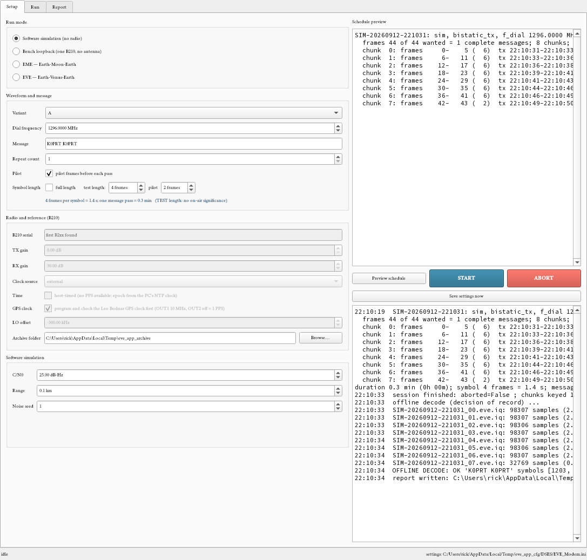
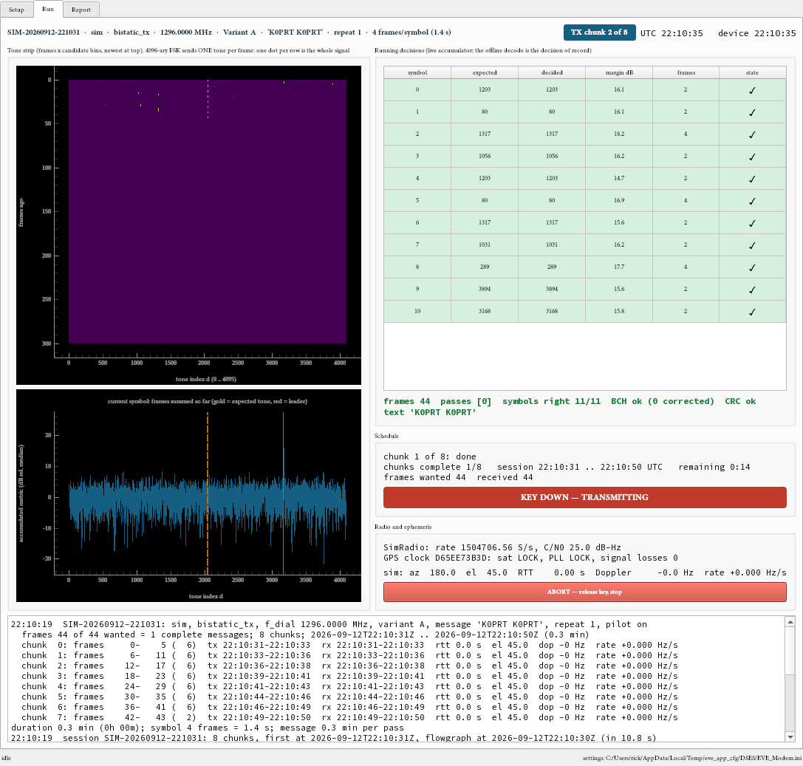
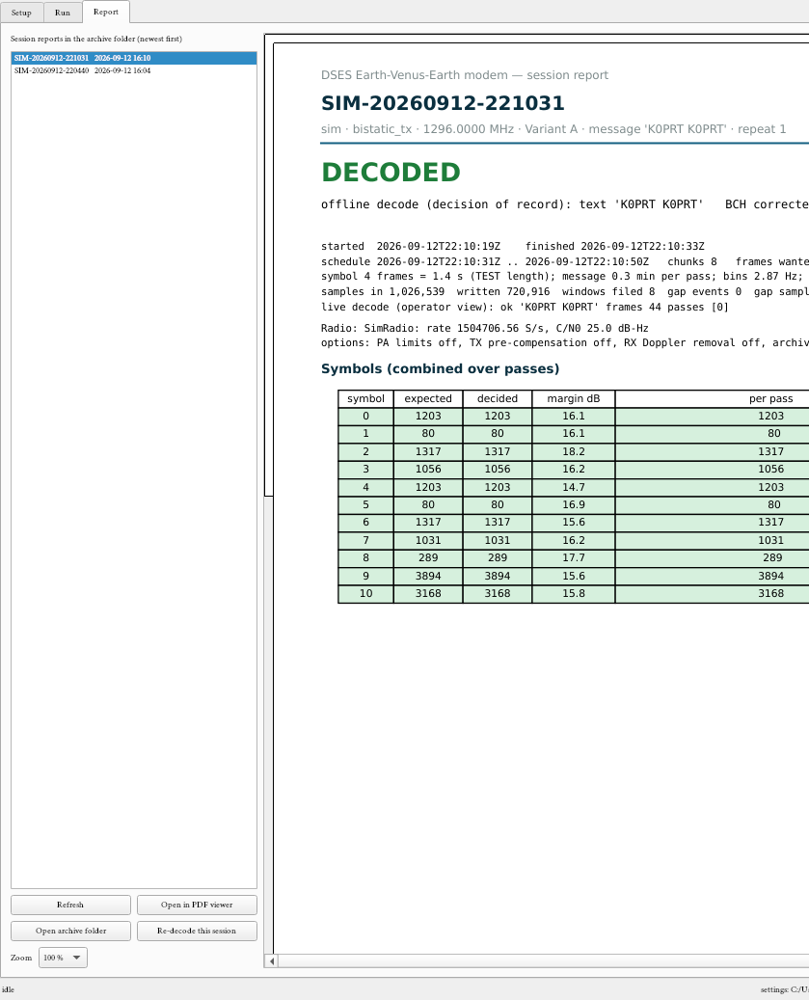

# Earth-Venus-Earth Modem — Operator's Guide

<!-- widths: 1.4,5.3 -->
| | |
|---|---|
| Document | DSES EVE Modem Operator's Guide |
| Revision | Rev C — DRAFT (program 1.0.7) |
| Date | 2026-09-23 |
| Prepared by | Rick Hambly, K0GD, Deep Space Exploration Society |
| Companion | DSES EVE Modem Design Description and ICD (Rev C): the why behind every setting |
| Where it lives | This text is the application's Help → Operator's guide, and `docs/DSES_EVE_Modem_Operators_Guide.pdf` |

The waveform this program sends and receives is the Open Research Institute's Spiral #2,
designed by Pete Wyckoff, KA3WCA, with the reference implementation by Michelle Thompson;
the station software is DSES's. This guide is for the person at the keyboard at Haswell. It says what to connect, what
to click, what to watch, and what to do when something is wrong. The design document
explains the reasons; this one gives the steps.

# 1. What the program does

The DSES EVE modem sends an 11-symbol message (K0PRT K0PRT) as one tone at a time out
of 4096 possible tones, bounces it off the Moon or Venus, and decides which tones came
back. One symbol lasts 164.8 seconds (473 frames of 0.35 s); a whole message takes 30.2
minutes per pass, and several passes are added together before the decision. The program
does all of it from one window:

- **Setup**: pick the kind of run, set the frequency, gains, message, and timing; preview
  the schedule; press Start.
- **Run**: watch the tones arrive, the decisions form, the chunks progress, the key line,
  the radio and the GPS clock.
- **Report**: read the session report when the run ends, re-decode an earlier one, or tick
  Compare to put two reports side by side.

The settings are remembered between runs, so the desktop icon opens the program ready
for the last test. A run can be repeated, changed, and repeated again without restarting
the program.

# 2. Before you start: the hardware checklist

<!-- widths: 1.8,4.9 -->
| Item | What to check |
|---|---|
| B210 | On a USB 3 port of the PC (a direct rear port, not the powered extension cable). It appears in Device Manager under "USRPs". After a power event that leaves it unrecognized, unplug USB and the DC barrel for 15 s (a true cold start). |
| GPS reference clock (Leo Bodnar) | OUT1 to the B210 **REF IN** (10 MHz). OUT2 to the B210 **PPS IN** (with output 2 disabled the OUT2 connector carries the 1 PPS; the program sets this). USB to the PC. GPS antenna with a clear sky view. Both LEDs steady after a few minutes = locked. |
| Switching (TX key and LNA) | The modem is the sequencer: two signals, each on two outputs in parallel. **USB relay board** (DIUSTOU DSTUR-T20, `docs/hardware/diustou_dstur_t20.md`): relay 1 COM/NO = TX key (closed = transmit), relay 2 COM/NO = LNA control (closed = LNA off). **B210 J504** through an external circuit: **GPIO_0** = TX key (high = transmit), **GPIO_1** = LNA (high = LNA off), ground on pin 9 or 10, 3.3 V logic. Both released / low = receive, so an unplugged board or a dead PC leaves the feed receiving. GPIO_0 alone can drive an external sequencer (DB6NT style); GPIO_1 is then ignored. On the DSES clone the front-panel IO connector is a white 2x5 shrouded header (2.54 mm pitch, 10-pin IDC ribbon socket or Dupont leads) whose legend gives the GPIO numbers: top row G 6 4 2 0, bottom row G 7 5 3 1. Never straight to a sequencer input without the isolating circuit. |
| Transmit | B210 **TX/RX A** to the driver's input pad. The B210 gives at most +8 dBm; the driver decides the TX gain setting (Setup → TX gain). |
| Receive | LNA output (through the bandpass filter if fitted) to B210 **RX2 A**. Nothing on RX2 for the loopback bench. |
| Sequencer | None in the station: the modem sequences the LNA and the transmitter itself (LNA off, guard, TX on; TX off, release, LNA on; abort takes the same way out, transmitter first). The amplifier's own interlocks stay armed; the 2 kW load only for the thermal test. |
| PC clock | The PC needs internet NTP (the second number of the PPS-edge time set comes from it). Windows: Settings → Time → Sync now. |
| Pointing | The dish tracks the target under System 1 (RA/Dec, J2000). The Run tab shows the target's azimuth and elevation from the ephemeris for a cross-check. |
| Archive folder | A folder with room for the run: about 24 MB per 30-minute pass at the modem rate. |

# 3. Starting the program

Double-click the **DSES EVE Modem** desktop icon (created once with
`install-shortcut.ps1`). The window opens on the Setup tab with the last settings. The
status bar shows where the settings file is. If the program does not start, read the log:
`%LOCALAPPDATA%\DSES\EVE_Modem\app.log` on Windows, `~/Library/Logs/DSES_EVE_Modem/app.log` on macOS,
`~/.local/state/dses-eve-modem/app.log` on Linux. A hard crash leaves `fault.log` beside it.

**Updates.** Once a day at start-up, and whenever you choose Help → Check for updates…,
the program asks gpstime whether a newer version is published. A newer one opens a
window with the release notes; **Install Update** downloads it, checks its SHA-256
against the published sidecar, and installs it over this copy (a backup is kept) or as a
new copy beside it, then offers a restart. Nothing is changed before the checksum
matches, and nothing is installed while a run is in progress. Skip this version or
Remind me later do what they say.



# 4. The Setup tab

Every control has a tooltip: hover over it or its label. The essentials:

## 4.1 Run mode

<!-- widths: 1.6,5.1 -->
| Mode | When to use it |
|---|---|
| Software simulation | No radio. Proves the decoder and the display at a chosen signal-to-noise. Run it first on any new PC. |
| Bench loopback | One B210, nothing on the antenna ports. Transmits at low gain, receives its own internal leakage. Proves the radio, the reference, the archive, and the decoder before anything goes on the air. |
| Signal generator | The B210 as a bench source for the RF package: CW, two tones, or the EVE waveform at the dial frequency, with the sequencer working and the level adjustable while it runs (TX gain in 0.25 dB steps and a digital scale) or stepped on a timer. For power-out, compression, and tuning measurements on the 23 cm and 13 cm packages, and for checking the station's wiring to the relays and GPIO lines with no RF at all. See section 4.6. |
| Interop with a partner station | Compatibility test with ORI's own hardware and software, on the bench through a cable and attenuator or across the room: transmit only (their receiver decodes us) or receive only (their generator transmits, we archive and decode). No Doppler, no round trip, no amplifier limits. See section 7.1. |
| EME | Moon bounce. Ephemeris from JPL Horizons, Doppler pre-compensated, transmit 2.4 s then listen for the 2.5 s echo, repeat. The rehearsal before Venus. |
| EVE | Venus bounce. 240 s transmit chunks against the 272 s round trip. A full message is 30.2 minutes per pass; plan five passes. |

**Set defaults for this run mode** puts every setting the mode cares about back to the
design value: frequency, repeat count, symbol length, gains, chunking, timing, Doppler.
The status line lists what changed. Changing the run mode, the variant, the symbol length,
or the interop direction also applies a few consistency rules (a sky session gets
full-length symbols and an external clock, Venus gets 1299.5 MHz and the amplifier
limits, a Variant B chunk grows to hold the pilot, receive-only interop drops the pilot)
and says so in the teal line under the run modes.

## 4.2 Waveform and message

- **Variant** A is the ORI air interface (2.87 Hz bins, 473 frames per symbol). Use A
  whenever another station must decode us. B is a DSES-only variant.
- **Dial frequency**: 1299.5 MHz for Venus 2026 with the 23 cm package; 1296 on the
  bench. The comb sits 25 to 48.5 kHz above the dial.
- **Message**: K0PRT K0PRT, the club call. Up to 11 characters.
- **Repeat count**: passes of the message. The receiver adds them; five for Venus.
- **Symbol length**: **full length** (473 frames, 164.8 s per symbol) is the air
  interface. The **test length** (6 frames, 2.1 s) makes a whole message pass in 23 s
  for bench work. The program warns before sending a test-length signal on the air.
  **A short symbol is a deaf symbol.** The waveform reaches 0 dB-Hz only by adding
  473 frames; the blue line under the setting shows the C/N0 a one-pass decode needs
  (design 2.4 model, 10 % message error rate), and it rises 6.5 dB for every factor of
  ten fewer frames:

  | Frames per symbol | Symbol | Needs C/N0 above |
  |---|---|---|
  | 473 (full, Variant A) | 164.8 s | −0.6 dB-Hz |
  | 118 | 41 s | +3.0 dB-Hz |
  | 47 | 16 s | +5.4 dB-Hz |
  | 12 | 4.2 s | +9.5 dB-Hz |
  | 6 (bench default) | 2.1 s | +11.7 dB-Hz |

  So a software simulation at 2 dB-Hz with the 6-frame test length fails as it should;
  test sensitivity with full length (a 30 minute pass), or set the simulation C/N0 at
  least 3 dB above the line for the length in use. Repeat count helps: each doubling of
  passes buys about 3 dB.

## 4.3 Radio and reference

- **TX gain** 0 dB on the bench; on the air, what the driver's input pad expects.
- **RX gain**: set so the background of the tone strip is visible but not saturated
  (30 dB on the bench, 40 to 50 dB behind the LNA).
- **Ports**: the B210 has two frontends, A and B, each with a TX/RX and an RX2 port.
  The station is wired TX on **A** (TX/RX A to the driver) and RX on **A : RX2** (the
  LNA), and those are the defaults. Change them for a board with a bad side, or to
  compare ports on the bench: TX on B, RX on B : RX2, or RX on the TX/RX port of the
  frontend that is not transmitting. The same frontend's TX/RX for both directions is
  refused. The line under the setting says when the choice differs from the station wiring.
  **Port isolation is not equal on the two sides.** Measured on two B210s (Workbench
  bench, 2026-09-14): with the receiver on frontend A, the unselected port leaks into
  the selected one at only about 5 dB (TX/RX state) to 17 dB (RX2 state); on frontend
  B it is about 26 dB, and between the two frontends it is best of all. So a loopback
  bench through side A shows a very strong signal (margins near 40 dB) and one
  through side B a weak one (a few dB): both are normal. For the station this favours
  transmitting on A and receiving on B : RX2 when the cabling allows; to be revisited.
- **Clock source** external (the GPS clock on REF IN and PPS IN). The run refuses to
  start unless the B210 reports lock.
- **Time**: leave host-timed unticked when the PPS is connected. Tick it only if there
  is no PPS; the epoch then comes from the PC clock, still inside the tolerance.
- **Clock source** has a sub-item: tick "the external reference is the Leo Bodnar GPS
  clock on USB" when that clock is the reference; the program then sets it to the
  station setting and waits for lock before opening the radio. With the HP5065A rubidium
  (plus a PPS source) back in service, untick it; the B210's own lock check still runs.
- **Archive folder**: where the run's files go.
- **Keying**: the modem is the station's sequencer (design 7.2, D24). *none* switches
  nothing (bench, simulation, receive only). Otherwise two signals go out on two outputs
  in parallel: **TX key** (relay 1 of the USB board and B210 GPIO_0; energized or high =
  transmit) and **LNA** (relay 2 and GPIO_1; energized or high = LNA off). Both released
  is receive. The USB board's port is *auto*: the program finds the board wherever it is
  today. If no board answers, the run goes ahead on the GPIO lines and tells you so in a
  box, the status bar, and the log. **Test TX** and **Test LNA** click the relays for a
  second without touching the radio. The two guard times are the gaps between switching
  the LNA off and keying the transmitter, and between unkeying and switching the LNA back
  on; the RF starts 200 ms after the key as before. The switching runs in **every** mode,
  the software simulation and the loopback bench included, so the relays can be watched
  and timed with nothing on the air (in the simulation the GPIO lines are recorded rather
  than driven). It needs 1.5 s of silence between chunks; the program raises the minimum
  off time to that when the switching is on. Choosing none for an EME or Venus run is
  allowed but the teal line warns.

## 4.4 Mode settings

The group under the radio settings changes with the mode. For EME and Venus the sky
session group adds the start time (now plus a lead, or a UTC time), the ephemeris source
(Horizons, astropy fallback), the station mode (monostatic, or transmit-only for a
partner receiver), and the Doppler handling. The defaults are the design values; change
them only for a reason you can write in the log.

## 4.5 Preview, Start, Abort

**Preview schedule** builds the schedule without touching the radio and lists every
chunk with its times, frames, round trip, elevation, and Doppler, then the total
duration. For a sky session this fetches the ephemeris, which takes a few seconds. Check
the elevation and the duration before Start.

**START** saves the settings, programs the GPS clock, opens the radio, builds the
schedule, and switches to the Run tab. The first chunk starts after the lead time (15 s).

**ABORT** releases the key line at once, stops the streams, closes the archive, and
writes the log. Use it for any fault. The same button is on the Run tab.

## 4.6 Signal generator

The **Signal generator** run mode turns the B210 into the bench source for integrating
the RF package: driver, amplifier, filters, feed, and the sequencer wiring. It transmits
for the duration you set and nothing else: no receive window, no decode. The **Signal
generator** group holds its settings.

<!-- widths: 1.4,5.3 -->
| Setting | What it does |
|---|---|
| Signal | **CW**: one tone at the dial frequency plus the offset. **Two-tone**: two equal tones centered on the offset and spaced as set; the two-tone test shows an amplifier's intermodulation and the onset of compression. **EVE waveform**: the real 4096-FSK message with the pilot, exactly what a session sends. |
| Offset | Where the tone sits relative to the dial frequency (0 puts it on the dial; the modem's own IF comb sits 25 kHz above). |
| Spacing | Two-tone only: the distance between the two tones. |
| Digital scale | The fine level: dB below full scale, applied instantly. Combine with **TX gain** in the Radio group (coarse, 0 to 89.75 dB in 0.25 dB steps). Both can be changed while the generator runs; every change is logged with its time and goes into the report. |
| Duration | How long to transmit. With **PA** ticked the run is chunked by the amplifier limits (300 s on, 240 s off) and the total on-time still adds up to the duration. |
| PA | Enforce the amplifier duty limits. Tick whenever an amplifier is in the chain. |
| Dry run | Run on the simulated radio, no B210: the sequencer (relay board and simulated GPIO), the level controls, the sweep, and the report all work as they would on the air. Use it to check the station's wiring to the relays before the first real transmission, without risking a kilowatt. |
| Sweep | Step the TX gain from the start to the stop level by the step, holding each level for the hold time, beginning when the transmitter is keyed. A compression curve in one run: note the meter reading at each step against the times in the log, or read them off the report. |

The sequencer works here as in every other mode: the transmitter is keyed at the start
of each on-window in the safe order (LNA off, guard, TX key) and released at its end
(TX off, release, LNA on), the key lamp on the Run tab shows the state, and Abort drops
the transmitter first. The Run tab's radio box shows the generator line: the signal,
the current TX gain and scale, and the sweep. The report is a single page: the settings,
every level step with its UTC time, and the key events; it lands in the archive folder
with the schedule file.

A typical bench session: a **Dry run** first to see the relays click in the right order;
then the B210 into the driver at **TX gain** 0 and **Digital scale** -20 dB with the
power meter on the output; raise the gain until the meter reads the driver's rated
output; then a **Sweep** across the last 20 dB in 1 dB steps to find the 1 dB compression
point. Never run the generator into the amplifier without the load or the antenna
connected, and keep **PA** ticked whenever the amplifier is in the chain.

# 5. The Run tab: what to watch



<!-- widths: 1.6,5.1 -->
| Panel | What a healthy run looks like |
|---|---|
| Phase badge (top right) | Colored by state. Amber while the program is busy before the session (opening the radio, GPS clock, ephemeris, schedule) and after it (draining and closing the archive, closing the radio, offline decode window n of N, writing the report). Teal during the session: armed → TX chunk n of N → listening for chunk n → … Green DECODED or red NOT DECODED / ABORTED / FAILED at the end, and it stays there while the Report tab shows the result. If the badge is amber, the program is working; give the decode a few seconds per window. |
| Clocks | UTC (PC) and device time agree to milliseconds when the time was set on a PPS. |
| Tone strip | One bright dot per row (one tone per frame) that steps to a new column at each symbol boundary; a steady column during the pilot. The background is receiver noise. A blank strip means no signal, wrong RX gain, or the receive window is closed (between chunks). At Venus strength single frames show nothing: that is expected. |
| Current symbol | The sum over the frames of the symbol in progress. The yellow dashed line is the tone we sent; the solid red line with a dot on its peak is the leader. On the bench they coincide from the first frame; on Venus the peak climbs out of the noise as frames add up. |
| Running decisions | One row per symbol: expected, decided, margin in dB, frames summed. Green rows agree with what we sent. The line under the table shows the message the live accumulators would decode now. |
| Schedule | Chunk in progress, chunks complete, time remaining, frames wanted vs received. |
| Key lamp | Red while the transmitter is keyed; the line beside it reads TX and LNA state and names the outputs in use (the USB relay board, the B210 GPIO lines, or both), with any fault (a board that stopped answering). The transmitter is keyed 200 ms before the RF and released 100 ms after; the LNA switches off a guard time before that and back on a release time after. |
| Radio and ephemeris | LOCKED must be shown on the air. LO offset ok in both directions. GPS clock: sat LOCK, PLL LOCK. Target azimuth, elevation, round trip, Doppler, and rate. |
| Log | Every step the program took, keying events, radio messages, decode results. |

The live decisions are a view for the operator; the decision of record is the offline
decode of the archived windows that runs when the session ends and appears in the report.

# 6. The Report tab



When a run ends the program decodes the archive, writes
`<session>_report.pdf` beside the session log, and shows it here: the verdict, the
decisions with margins per pass, the chunk timeline with key events, the per-window
synchronization (pilot offset, tracker residual, sample gaps), and the key-event list.

- **Open in PDF viewer** for printing or sending.
- **Open archive folder** to reach the raw files.
- **Re-decode this session** runs the offline decode again on the archived windows and
  rebuilds the report (after a software fix, or to try without the pilot).
- Earlier reports in the same folder are listed; click one to view it. The teal bar over
  the pages names the report shown.
- **Compare** opens a second pane with its own chooser, so two runs sit side by side
  (Zoom 50 % fits both on a laptop screen).

# 7. The test sequence at the site

1. **Software simulation** at C/N0 20 dB-Hz, test-length symbols: proves the program on
   the site PC. One minute.
2. **Bench loopback**, test length, TX gain 0, GPS clock ticked, clock source external:
   proves the B210, the reference lock, the PPS time set, the archive, the decode. About
   two minutes. Both passes should decode at 20 dB or more of margin.
3. **Bench loopback, full length, one pass** (34 minutes): proves the long streams with
   no underruns and the amplifier-limit chunking at real length. Run it once per PC.
4. **EME**, test length first, then full length, with the dish on the Moon: the echo path,
   the Doppler pre-compensation, the sequencer, the LNA, and the gains. Expect the echo
   in the receive windows 2.5 s after each chunk.
5. **Venus**: full length, five passes, start time from the session plan.

After every run, read the report before deciding the next step. Keep the archive folder;
the raw windows can be decoded again later.

## 7.1 The interop test with ORI

Both ends agree on four things beforehand: Variant A with full-length symbols, the dial
frequency, the message (K0PRT K0PRT), and the UTC start of the transmission. In the
program choose **Interop with a partner station**, tick **full length**, and set the start
either as "now + lead" (tell the partner the time the preview shows) or as the agreed UTC
time.

- **Transmit only**: we send the message; the partner's receiver decodes it. Their
  result is the test result. Our report shows what left the radio.
- **Receive only**: the partner transmits from their generator, which has no pilot:
  **untick Pilot**. We send no RF and key nothing. After the run the decoder searches for
  their actual start within the **start search range** (30 frames = ±10 s around the
  agreed time; widen it if their start is looser) and the report says by how many frames
  they were off and whether the message decoded.

Cable and attenuator: the B210 puts out up to +8 dBm, and its receiver wants no more than
about −20 dBm at RX2, so 30 to 40 dB of attenuation between two radios on the bench.

# 8. When something is wrong

<!-- widths: 2.3,4.4 -->
| Symptom | What it means and what to do |
|---|---|
| "GPS clock not locked; refusing to start" | The Leo Bodnar clock has no satellite or PLL lock. Check the antenna's sky view and the LEDs; wait a few minutes after power-up; after reprogramming the PLL drops for a few seconds and relocks within 20 s. |
| "reference not locked (external)" | No 10 MHz at REF IN, or the clock is not locked. Check the OUT1 cable and the clock's LEDs. |
| "USRP time did not take on the PPS edge" | No PPS at PPS IN. Check OUT2 to PPS IN (output 2 must be disabled: the program does that). As a fallback tick host-timed. |
| "PPS verify False" in the log | Same as above: no second PPS edge was seen. |
| A storm of 'L' or LATE_COMMAND in the log at the start | The radio was not armed in time. Increase the lead time (15 s or more) and close other programs. |
| 'O' or overflows in the log | The PC dropped receive samples. One short overflow at start-up is known and padded; repeated ones mean the PC is too busy: close other programs, use a direct USB 3 port. The archive records every gap. |
| Blank tone strip during a receive window | No signal or wrong RX gain. On the bench check TX gain 0 and nothing on the antenna ports; on the air check the LNA and the sequencer. |
| Decisions wrong on the bench | Reference unlocked (frequency off), or the LO offset fell back (the radio line says so). Do not go on the air until the bench decodes. |
| "a chunk of N frames cannot hold the pilot frames plus data" | The chunk is too short for the pilot. Variant B frames are 0.667 s, so the 2.4 s bench chunk holds three frames and two are pilot: use a chunk of 4 s or more for Variant B (the message says the minimum). |
| "chunk would hold no frames" | The chunk settings leave no room between the round trip and the guard. Restore the mode's defaults. |
| Horizons unreachable | The ephemeris source falls back to astropy with the local DE440s. The Doppler differs by up to 10 Hz at 13 cm; acceptable, but note it in the log. |
| "the run worker died while opening the radio ... retrying" | Every run lives in its own worker process, and opening the B210 faults about one time in seven on Windows (a UHD fault, not the radio). The program retries the open up to three times by itself; the log shows each try. If all three fail, power-cycle the B210 (USB and DC off for 15 s) and Start again. The window never closes because of it. |
| The program closes by itself | A native library crashed. Two files in the log folder (section 3) tell the story: `app.log` (everything the program printed) and `fault.log` (the traceback of a hard crash). Send both. If the B210 was left streaming by a program that was killed, power-cycle it (USB and DC off for 15 s) before the next try. |
| A PDF (report or guide) opens in LibreOffice Draw with text spilling over the right margin (Linux) | Draw imports the PDF for editing with substitute fonts; the file is fine (the Report tab renders it with its embedded fonts). The program now opens PDFs in a viewer (Evince, Okular, Firefox) when one is installed; to fix the desktop default: `xdg-mime default org.gnome.Evince.desktop application/pdf`. |
| Help → Check for updates says "urlopen error timed out" | The server sometimes takes 10-15 s to accept the first connection and is instant after that. Try again; the second check goes through. (From 1.0.5 the check waits 30 s and tries twice by itself.) |
| The program will not start from the icon | Read `app.log` in the log folder (section 3). The project environment must exist in `.conda` next to the program. |

# 9. Files a run produces

In the archive folder, all named by the session id (mode and UTC start):

- `<session>.json` — the schedule (the contract with any partner station).
- `<session>_<target>_haswell.csv` — the ephemeris table used (sky sessions).
- `<session>_NN.eve.iq` + `.json` — one receive window per chunk, complex float samples
  at the modem rate with a sidecar (start time, first frame, gaps).
- `<session>_session.json` — the session log (times, keying, radio, live decode).
- `<session>_report.pdf` — the report.

# 10. Installing on another computer

The program is a zip, `eve-modem-<version>.zip`, from
`https://gpstime.com/sw_distribution/eve-modem/` (the folder also holds this guide and
the design document). It carries no Python: it runs on a conda environment with GNU
Radio, UHD, PySide6, and a few pip packages, the same radioconda base the DSES Workbench
uses. Windows, macOS, and Linux (including a Raspberry Pi 5 with the aarch64 radioconda)
use the same zip.

1. Install radioconda (https://github.com/ryanvolz/radioconda) or any conda with the
   conda-forge channel.
2. Unzip the release; it makes one folder `eve-modem-<version>`.
3. In that folder create the program's environment from the included file:

   ```
   conda env create --prefix .conda -f environment.yml
   ```

   (about 3 GB; ten minutes). This installs gnuradio, uhd, numpy, scipy, astropy,
   jplephem, pyside6, pyqtgraph, matplotlib, pytest, and the pip extras galois, sigmf,
   hidapi, pymupdf, pyserial. On Linux the USB HID clock and the CH340 relay need the
   usual udev permissions (a rule for USB 1dd2:2210, membership of `dialout`).
   **One-command version of steps 1-4 for a Mac or Linux machine that already has
   radioconda** (adds the extras, downloads and verifies the zip, unzips into
   `~/Applications`, starts the program, shows the log if it dies):

   ```
   curl -fsSL https://gpstime.com/sw_distribution/eve-modem/mac_first_run.sh | bash
   ```

   **Lighter alternative** if the machine already runs the DSES Workbench from radioconda:
   skip the new environment and add the extras to radioconda instead, then the launcher
   finds it by itself:

   ```
   ~/radioconda/bin/pip install galois sigmf hidapi pymupdf pyserial astropy jplephem
   ```

   (Windows: `C:\ProgramData\radioconda\Scripts\pip.exe install ...` with the same list; the
   launcher finds radioconda in `C:\ProgramData` or your profile by itself, or set `EVE_PYTHON`
   to a `python.exe`. If an extra is missing the launcher says which one and how to add it.)

   **Linux: install a PDF viewer** if the desktop has none (Ubuntu with LibreOffice opens
   PDFs in Draw, which re-flows them with substitute fonts). Evince is the one to have:

   ```
   sudo apt install evince
   ```
4. Start it: Windows `launcher.bat` (or `install-shortcut.ps1` once for a desktop icon);
   macOS `launcher.command` (or `install-shortcut.command` once for an app on the
   Desktop); Linux `bash launcher.sh` (or `install-shortcut.command` once for a menu
   entry). The launchers use `.conda` beside the program if it exists, else
   `EVE_PYTHON`, `RADIOCONDA_ROOT`, `CONDA_PREFIX`, or `~/radioconda`.
5. First run: choose **Software simulation**, press Start, and watch a message decode
   with no hardware at all. Then the bench loopback with a B210.

Updates arrive through Help → Check for updates (section 3). The B210 needs the UHD
FPGA images (`uhd_images_downloader` in radioconda) the first time it is opened.

# 11. Command-line equivalents

The window drives the same code as the tools in `tools/`: `eve_session.py plan | run |
sim`, `eve_bench.py`, `eve_decode.py`, `eve_txcw.py` (one comb tone into the lab counter),
and `python -m eve.gpsdo status | config | preflight` for the GPS clock. Use them for
scripted tests and for the field log; the design document section 5.1 lists their options.
