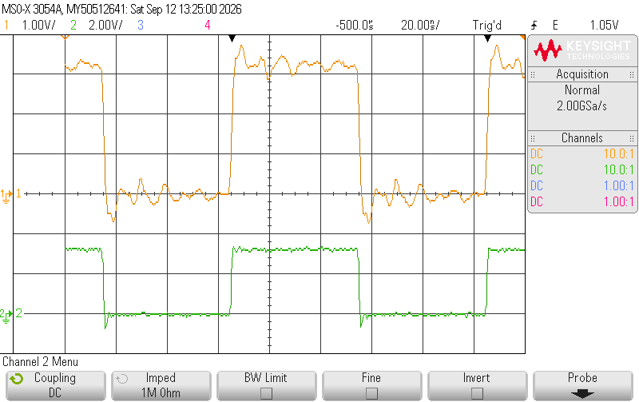
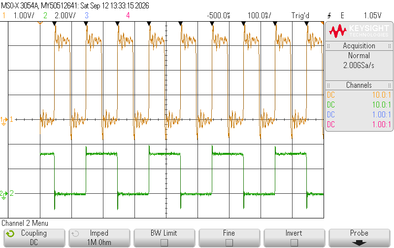
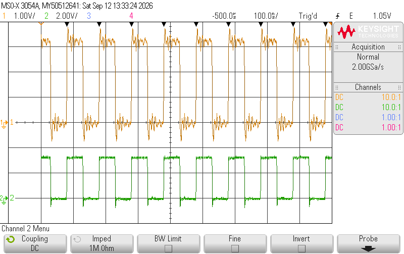
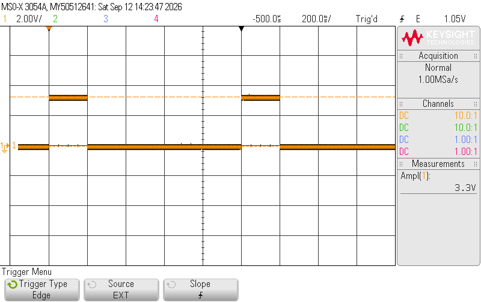

# Bench note: Leo Bodnar Precision GPS Reference Clock as the station reference

Date 2026-09-12, CNS Systems bench. Unit: "GPS Reference Clock" serial G44009
(USB VID 0x1DD2, PID 0x2210, the classic dual-output model). Both outputs into the
Agilent MSO-X 3054A (CH1 = OUT1, CH2 = OUT2, 10:1 probes, 1 MΩ, unterminated; external
trigger). Purpose: replace the failed HP5065A rubidium as the B210's 10 MHz reference
for the EVE modem (design document 4.3, 7.1; open issue O16), and let the modem set
the clock up itself (`eve/gpsdo.py`).

## As found

| Item | Value |
|---|---|
| Satellite lock / PLL lock | locked / locked; 1 signal-loss event since power-up |
| GPS-derived reference f_in | 4,687,500 Hz |
| Divider plan (vendor) | N3 5 (f3 937.5 kHz), N2 11 × 512 (f_osc 5.280 GHz), N1_HS 11, NC1 48, NC2 48 |
| Outputs | OUT1 10.000000 MHz, OUT2 10.000000 MHz, both on, skew 0, loop bandwidth code 15 |
| Drive level | 1 = 16 mA (about +11.4 dBm into 50 Ω) |
| Scope, CH1 (OUT1) | 10.000000 MHz, 4.46 Vpp unterminated (3.3 V CMOS with edge ringing on the unterminated probe) |
| Scope, CH2 (OUT2) | 10 MHz square, 4.1 Vpp unterminated, in phase with OUT1 |

## What the modem's settings do (write test)

`python -m eve.gpsdo set --out1 10e6 --out2 5e6 --level 2` reprogrammed the clock over
USB (PLL command with NC2 = 96, then level 2 = 24 mA, then both outputs enabled) and
read the configuration back:

| Item | Read back |
|---|---|
| OUT1 | 10.000000 MHz (NC1 48, vendor oscillator plan kept) |
| OUT2 | 5.000000 MHz (NC2 96) |
| Drive level | 2 = 24 mA (about +12.7 dBm) |
| Scope, CH1 | 10.00 MHz, 4.70 Vpp |
| Scope, CH2 | half the CH1 rate (200 ns period at 100 ns/div), 5.3 Vpp, Vmax 3.91 V |

`python -m eve.gpsdo restore-default` put the vendor plan back (both 10 MHz, level 1).
Scope: CH1 10.00 MHz 4.50 Vpp, CH2 10 MHz 4.1 Vpp. Timebase returned to 20 ns/div.

## Findings

- **The USB HID protocol works as documented by the open-source `lbgpsdo` tool**:
  2-byte input report (signal-loss count; bit 0 = no satellite lock, bit 1 = no PLL
  lock), feature report 9 for the configuration (60 bytes after the report id), and
  61-byte feature reports for the PLL, level, and output-enable commands. On Windows
  the feature read must ask for 61 bytes (report id included) or hidapi reports a
  read error.
- **Reprogramming drops the PLL for a few seconds**; it re-locked within about 20 s.
  The modem's preflight therefore programs the clock, then waits for lock (60 s
  limit) before opening the radio.
- **1 PPS is not reachable through the divider chain** (minimum output 450 Hz; the
  divider limits stop near 27 Hz). The product page's "output 2 showing 1 PPS timing"
  mode is not exposed by this protocol; if the vendor software can set it, the
  configuration bytes read back afterwards will show how (the tail of report 9 holds
  39 undocumented bytes). Until then the B210 runs **host-timed**: frequency from the
  clock's 10 MHz, epoch from the host's NTP clock (`--time-source host`), accurate to
  tens of milliseconds against a one-frame (0.35 s) tolerance.
- **Drive level for the B210**: level 1 (16 mA, about +11.4 dBm into 50 Ω) is inside
  the B210 REF IN range and is what the modem applies; level 0 (8 mA, +7.7 dBm) is
  the conservative alternative. The ringing on CH1 is the unterminated 10:1 probe on a
  CMOS edge, not the clock; the B210's 50 Ω input will see a clean edge.
- The modem's planner (`plan_outputs`) finds exact divider plans in under 0.1 s, but
  `apply()` keeps the vendor's oscillator plan whenever the requested outputs divide
  it, so only the output dividers change.

## What the modem does with it

- `python -m eve.gpsdo status | config | set | restore-default | preflight`
- `tools/eve_session.py run … --gpsdo` and `tools/eve_bench.py --gpsdo`: preflight
  sets OUT1 to 10 MHz at level 1 if it is not already, waits for satellite and PLL
  lock, and refuses to start otherwise.
- The operator display's radio panel shows the clock's lock state and signal-loss
  count beside the B210's own `ref_locked`.

## Afternoon: the setting the modem enforces, and the B210's input limits

Rick's decision (11:00): OUT1 = 10 MHz for the B210, OUT2 off. Between the morning
tests and this, Rick updated the unit's firmware from 1.2 to 1.7 (vendor Firmware
Doctor). The same unit then enumerated with USB serial D65EE73B3D on a new device path
(the 1.2 firmware reported G44009; the vendor page says a firmware change leaves the
serial unaffected, which is not what this unit did), with zero signal losses since the
restart. The report-9 tail changed in two bytes (…d9dcfe47… became …d90cfe43…), the
documented fields did not, and the modem's decode still agrees with the scope. The
firmware update also rewrote the plan: it (GPS reference f_in 97,600 Hz, N3 1, N2 10 × 6250, f_osc 6.100 GHz,
N1_HS 5, NC 122, loop bandwidth 9, level 3 = 32 mA), so f_in is not fixed by the
hardware and the vendor's oscillator can run above the 5.67 GHz the open-source tool
assumed; the modem's limit is now 6.2 GHz and its preflight leaves any plan alone as long
as OUT1 reads 10 MHz exactly. Applied and read back: level 1, OUT1 on, OUT2 off.

| Item | Value |
|---|---|
| B210 REF IN (UHD manual) | 10 MHz, +15 dBm maximum |
| B210 PPS IN (UHD manual) | 1.8 to 5 V logic |
| Clock at level 3 (32 mA) | 6.3 Vpp unterminated on the scope, about +13.3 dBm into 50 Ω: within 2 dB of the B210 maximum, so not used |
| Clock at level 1 (16 mA), the setting kept | 4.3 Vpp unterminated (Vmax 3.46 V), about +11.4 dBm into 50 Ω, 3.6 dB under the maximum |
| OUT2 disabled | CH2 200 mVpp residual, average −72 mV |

A 3.3 V CMOS PPS (from a CNS Clock or an LBE-1421) is inside the B210's 1.8 to 5 V
PPS window; this unit provides no PPS.

**Closed 11:10:** with firmware 1.7 and GPSClockConfig 9.12 the vendor program offers
only a frequency in Hz for Output 2, no 1PPS choice (Rick). This unit has no PPS. The
PPS for the B210 comes from a CNS Clock (3.3 V, inside the 1.8 to 5 V window) or the
modem runs host-timed.

## 11:25: OUT2 disabled IS the 1 PPS

With Output 2 disabled (the modem's standard setting) and firmware 1.7, the OUT2 pin
carries the GPS receiver's 1 PPS. This is the product page's "solid LED 1, blinking LED 2:
output 2 is showing 1PPS timing". Measured on the scope (OUT2 on CH1, 200 ms/div):

| Item | Value |
|---|---|
| Frequency / period | 1.00003 Hz / 999.97 ms (scope resolution) |
| Positive width | 199.98 ms |
| Levels | high 3.46 V, low −0.24 V unterminated (3.3 V CMOS) |

So one box serves both B210 inputs: OUT1 (10 MHz, level 1) to REF IN and OUT2 (off =
1 PPS) to PPS IN, and the design's PPS-edge time set applies unchanged. The 200 ms pulse
is inside the B210's 1.8 to 5 V PPS window; the B210 latches its rising edge.

## 11:33: B210 loopback bench on the clock's 10 MHz and 1 PPS (O16: lock and PPS proven)

OUT1 to the B210 REF IN, OUT2 (disabled = 1 PPS) to the B210 PPS IN. Run:
`tools/eve_bench.py --clock external --gpsdo --display` (time source follows the clock
source, so the design's PPS-edge time set was used, not host-timed mode).

| Item | Result |
|---|---|
| GPS clock preflight | OUT1 on, OUT2 off, level 1; satellite and PLL locked |
| B210 reference | clock external / time external, `ref_locked` True |
| Time set | on a PPS edge: device time 1789234368.211 with last PPS 1789234368, set error 0.000000 s; PPS verify True |
| Rate error | +0.301 ppm (the fixed FPGA rate rounding, same as on the internal reference) |
| Session BENCH-20260912-113249 | 22 chunks, 132 frames, one start-up overflow of 9,603 samples padded |
| Decode | live and offline: K0PRT K0PRT, both passes, 0 bits corrected, margins 24.1 to 25.6 dB |

This answers the reference-lock and PPS half of open issue O16 (design document 7.1); the
transmit-frequency check against the lab reference on the 53230A remains. The clock is a complete
substitute for the HP5065A plus site NTP as far as the modem is concerned. The
host-timed mode (`--time-source host`) stays as the fallback for a clock without PPS.

## 13:06: transmit frequency against the lab reference (O16 closed)

B210 TX/RX A into the Keysight 53230A channel 3 (option 106, 6 GHz input; counter on the
lab's external 10 MHz), B210 locked and timed from the Leo Bodnar clock, one comb tone at
f_dial + f_IF = 1,296,025,000 Hz (tone 0, amplitude 0.8, TX gain 80 dB), by
`tools/eve_txcw.py --gpsdo --clock external --tx-gain 80`:

| Gate | Readings | Mean error | Spread (rms) |
|---|---|---|---|
| 1 s | 10 | −0.057 Hz (−0.044 ppb) | 0.062 Hz |
| 10 s | 6 | −0.030 Hz (−0.023 ppb) | 0.012 Hz |

Both pass the 0.1 Hz gate of design document 5.4. The 1 s spread is the GPS clock's
short-term noise against the lab reference (the E4438C on the lab reference read the
same counter steady to 0.02 Hz at every level from +10 to −20 dBm). The B210's own
tuning-word rounding put its centre at 1,296,000,000.0011 Hz; the tool takes that into
the baseband tone, as the modem's tone source does with the actual sample rate.

Two lessons on the way to the reading:

- **A bad SMA cable** in the bench kit: with it the counter saw nothing from the B210 at
  any gain up to the maximum (about +8 dBm), while the B210's own receiver showed the
  internal TX-to-RX leakage rising 85 dB for 80 dB of gain (`--rx-monitor`). The cable
  that had served the E4438C gave a reading at once. Rick retired the bad cable.
- **The counter's `INPut3:STRength?`** only reports a level once a measurement has run;
  asked cold it answers 0 and queues −221 / +263. The tool now takes a reading first and
  reports the strength after it. Channel 3 needs −27 to +19 dBm for CW.

The counter was left as found (1 s gate, free-running, local) after every visit, and the
E4438C was returned to its found state (1420.5 MHz, −110 dBm, RF on: the ambient carrier
the drift-scan notes have been seeing at 1420.4998 MHz).

